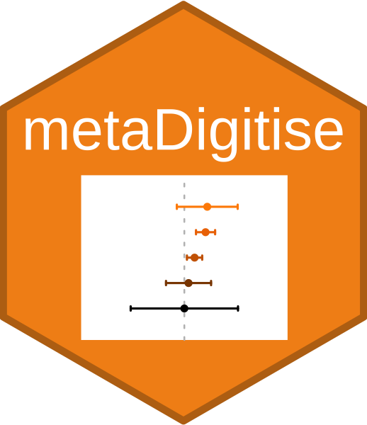
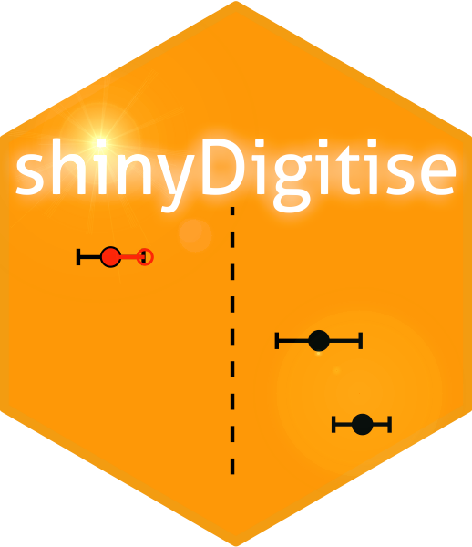

# [squidSim](https://github.com/squid-group/squidSim)
with the [SQuID working group](https://squid-group.github.io/squid-website/)

squidSim is a high flexible tool for simulating data from mixed effects models

 

# [metaDigitise](https://github.com/daniel1noble/metaDigitise)
with Dan Noble and Shinichi Nakagawa

metaDigitise is a tool that helps extract data from figures, primarily designed for meta-analysis

 

# [shinyDigitise](https://github.com/EIvimeyCook/ShinyDigitise)
with Ed Ivimey-Cook and Dan Noble

shinyDigitise is a shiny interface for metaDigitise

 

# [measuRe](https://github.com/joelpick/measuRe) 
with Ed Ivimey-Cook

measuRe is a tool that helps the length or area of an object in a picture, either with a scale or without (e.g. when the camera is a fixed distance)
