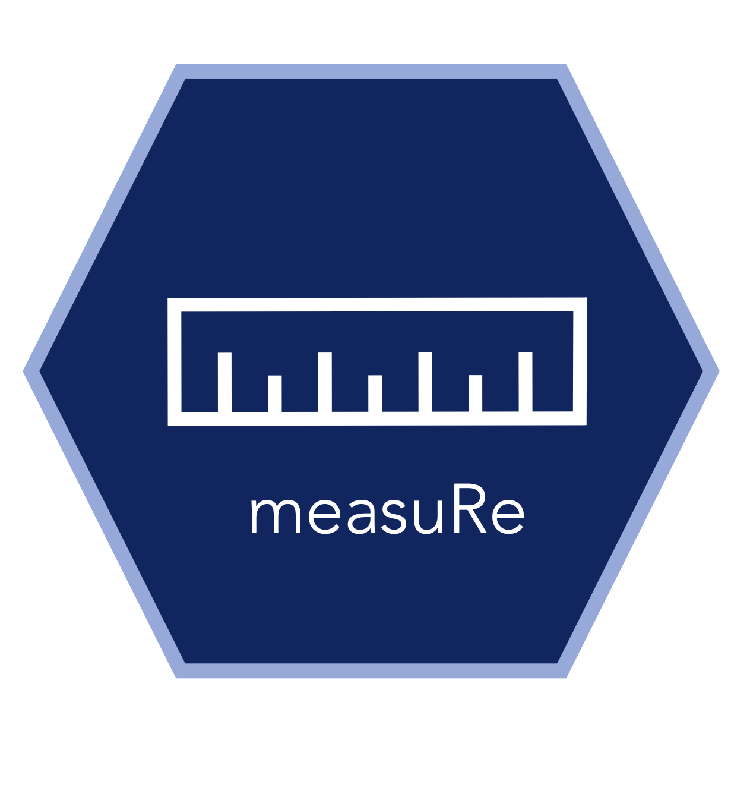

# [squidSim](https://github.com/squidgroup/squidSim)
with the [SQuID working group](http://squidgroup.org)

squidSim is a high flexible tool for simulating data from mixed effects models. An extensive vignette for this package can be found [here](https://squidgroup.org/squidSim_vignette/)

 

# [metaDigitise](https://github.com/daniel1noble/metaDigitise)
with Dan Noble and Shinichi Nakagawa

metaDigitise is a tool that helps extract data from figures, primarily designed for meta-analysis. We have extensive [documentation](https://github.com/daniel1noble/metaDigitise) and a [video tutorial](https://www.youtube.com/watch?v=2Q8TzgRSACM).

 

# [shinyDigitise](https://github.com/EIvimeyCook/ShinyDigitise)
with Ed Ivimey-Cook

shinyDigitise is a shiny interface for metaDigitise, for which we have a [video tutorial](https://www.youtube.com/watch?v=b9KvRsO8SPY).

 

# [measuRe](https://github.com/joelpick/measuRe) 
with Ed Ivimey-Cook

measuRe is a tool that helps the length or area of an object in a picture, either with a scale or without (e.g. when the camera is a fixed distance)
