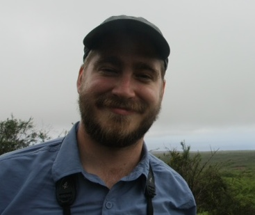

I'm a postdoctoral researcher, currently based at the University of Edinburgh, UK in the group of Dr. Jarrod Hadfield. My work focuses predominantly on the interactions between parents and offspring, and especially on the causes and consequence of variation in parental investment in birds. I am also interested in statistical methology, such as quantitative genetic modelling, comparative analysis and meta-analysis.
